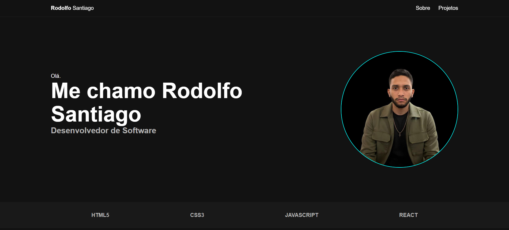

# 🚀 Portfólio | Rodolfo Santiago

## Preview

Olá! 👋  
Me chamo **Rodolfo Santiago**, sou **Desenvolvedor Front-end em início de carreira**, apaixonado por transformar ideias em soluções digitais por meio do código.

Este repositório reúne meus **principais projetos pessoais**, desenvolvidos com foco em **aprendizado prático**, **boas práticas** e **evolução contínua**.

---

## 🧑‍💻 Sobre mim
- Desenvolvedor Front-end Jr
- Experiência com **HTML, CSS, JavaScript e React Native**
- Participação em **bootcamps de programação**
- Buscando minha **primeira oportunidade profissional** na área
- Interesse em ambientes que valorizem **aprendizado contínuo e colaboração**

---

## 🛠️ Tecnologias & Ferramentas
- HTML5  
- CSS3  
- JavaScript (ES6+)  
- React Native  
- Git & GitHub  
- Expo  

---

## 📂 Projetos em Destaque

### 🧮 Calculadora | JavaScript
Aplicação web de calculadora funcional, focada em lógica de programação e manipulação do DOM.  
🌐 Deploy: https://rodolfosantiago03.github.io/PROJETO-CALCULADORA-VIRTUAL/ 

---

### ✅ Lista de Tarefas | JavaScript
Aplicação para gerenciamento de tarefas com adição, remoção e controle de estado.  
🌐 Deploy: https://rodolfosantiago03.github.io/PROJETO-LIST-TO-DO-LIST/

---

### ❌⭕ Jogo da Velha | JavaScript
Jogo interativo desenvolvido com JavaScript puro, aplicando lógica condicional e eventos.  
🌐 Deploy: https://rodolfosantiago03.github.io/JOGO-DA-VELHA-WEB/

---

### 📱 App Check-list | React Native
Aplicação mobile desenvolvida com React Native para controle de tarefas.  
📌 (Projeto em processo de finalização)

---

## 📈 Objetivo
Atuar como **Desenvolvedor Front-end Júnior**, contribuindo com projetos reais, evoluindo tecnicamente e crescendo junto com o time.

---

## 📬 Contato
- 💼 LinkedIn: https://www.linkedin.com/in/rodolfo-santiago-carneiro-braga-551a43329/ 
- 🧑‍💻 GitHub: https://github.com/rodolfosantiago03

---

⭐ Se quiser, fique à vontade para explorar os projetos e acompanhar minha evolução!
